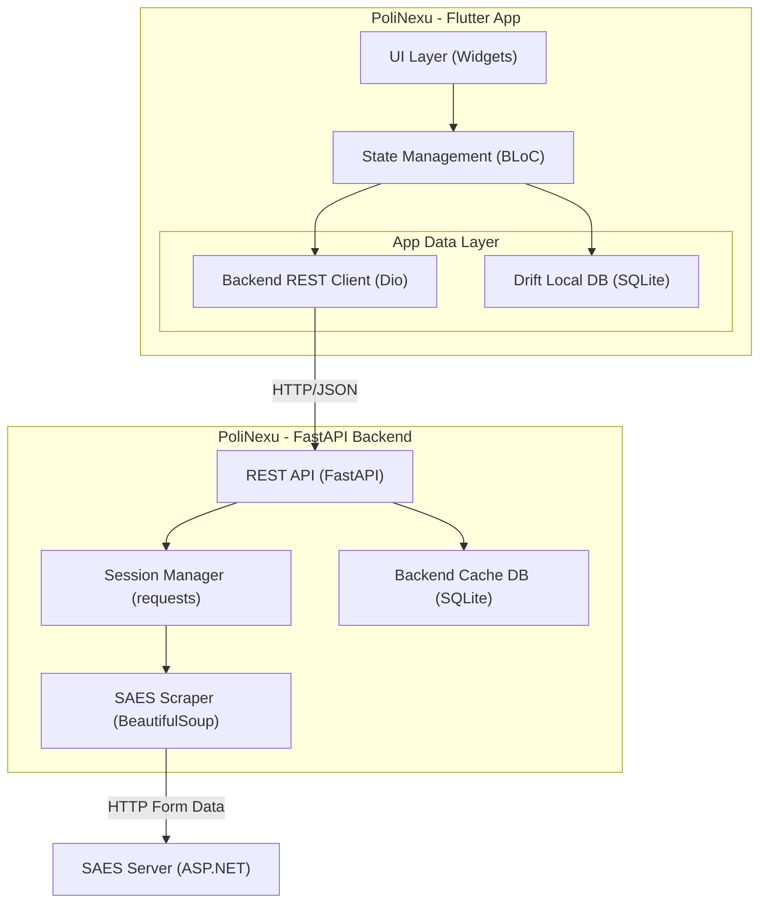

# Plan de Implementación: PoliNexu

## Descripción del Proyecto
**PoliNexu** es una app Android personal construida con **Flutter** que combina tres pilares funcionales:
1. **Gestor de horarios, tareas y actividades** con calendario visual y sistema de prioridades.
2. **Conector al SAES del IPN** (multi-escuela) para consultar calificaciones, horarios, kardex, datos del alumno y simular promedios.
3. **Sistema de recordatorios** con notificaciones push y alarmas configurables.

> [!IMPORTANT]
> El SAES **no tiene API oficial**. Toda la comunicación se realiza mediante **web scraping de ASP.NET WebForms**, lo que implica gestionar cookies de sesión, tokens `__VIEWSTATE` / `__EVENTVALIDATION`, y resolución manual de CAPTCHA.

---

## Decisiones Tomadas (Respuestas a Open Questions)

- **Scraping y Backend**: Se utilizará un **Servidor Backend en Python con FastAPI** para realizar el web scraping del SAES (usando `requests` y `BeautifulSoup`) y mantener vivas las sesiones. La app en Flutter consumirá este backend mediante una API REST en lugar de raspar directamente.
- **Base de datos del Servidor**: SQLite para el caché de sesiones y datos temporales en el backend.
- **Paleta de colores**: Estética inspirada en el diseño de **Gemini para Android** (Superficies suaves, bordes redondeados a 24px, sombras limpias) combinando tonos azules claros/oscuros (`#1E63D1` / `#A8C7FA`).
- **Ubicación del proyecto**: De acuerdo a las reglas globales, el desarrollo de la GUI de Flutter se realizará exclusivamente en `app/poliplayer/lib/`. El backend se ubicará en `backend/`.

---

## Arquitectura General



---

## Stack Tecnológico Propuesto

### Frontend (App Móvil)
| Componente | Tecnología | Justificación |
|---|---|---|
| **Framework** | Flutter 3.x (Dart) | Multiplataforma, interfaz apegada a reglas globales |
| **State Management** | flutter_bloc (BLoC/Cubit) | Escalable, separa lógica de UI |
| **Base de datos** | Drift (SQLite) | Para Tareas y caché offline local |
| **HTTP Client** | dio | Conexión con nuestro Backend FastAPI |
| **Tema** | Material 3 (Gemini UI) | Estética suave, azulada y redondeada |

### Backend (Servidor de Scraping)
| Componente | Tecnología | Justificación |
|---|---|---|
| **Framework Web** | FastAPI (Python) | Rápido, documentación automática, asíncrono |
| **Scraping** | requests + BeautifulSoup4 | Manejo robusto de HTML, ASP.NET sessions |
| **Base de datos** | SQLite + SQLAlchemy | Almacenamiento rápido de sesiones de usuario |

---

## Estructura del Proyecto

```
PoliNexu/
├── app/
│   └── poliplayer/                    # Proyecto Flutter (Según regla de usuario)
│       ├── lib/
│       │   ├── main.dart
│       │   ├── app.dart               # MaterialApp, temas, router
│       │   │
│       │   ├── core/                  # Utilidades compartidas
│       │   │   ├── constants/         # URLs del SAES, colores, strings
│       │   │   ├── errors/            # Excepciones custom
│       │   │   ├── extensions/        # Extension methods
│       │   │   ├── theme/             # ThemeData (light/dark, Material 3)
│       │   │   └── di/               # Configuración de get_it
│       │   │
│       │   ├── data/                  # Capa de datos
│       │   │   ├── database/          # Drift: tablas, DAOs, migraciones
│       │   │   ├── saes/              # Cliente SAES (scraper)
│       │   │   │   ├── saes_client.dart       
│       │   │   │   ├── saes_auth.dart         
│       │   │   │   ├── parsers/               
│       │   │   │   └── models/                
│       │   │   └── repositories/      # Implementaciones de repos
│       │   │
│       │   ├── domain/                # Capa de dominio
│       │   │   ├── models/            # Entidades de dominio
│       │   │   ├── repositories/      # Interfaces (contratos)
│       │   │   └── usecases/          # Casos de uso
│       │   │
│       │   ├── presentation/          # Capa de UI
│       │   │   ├── router/            # go_router config
│       │   │   ├── blocs/             # BLoCs / Cubits
│       │   │   ├── screens/           # Pantallas principales
│       │   │   └── widgets/           # Widgets reutilizables
│       │   │
│       │   └── services/             # Servicios transversales
│       │
│       ├── test/                      
│       ├── pubspec.yaml
│       └── android/                   
│
├── plans/                             # Planificación del proyecto
│   └── plan_polinexu.md
│
└── docs/                              # Documentación del proyecto
```

---

## Proposed Changes — Fases de Desarrollo

### Fase 1: Fundación del Proyecto (Sprint 1)
- [x] Configuración inicial, arquitectura base, y tema visual.
- [x] Crear proyecto Flutter en `app/poliplayer`
- [x] Configurar `pubspec.yaml` con dependencias iniciales (`flutter_bloc`, `drift`, `dio`, etc.)
- [x] Implementar `lib/core/theme/` (Sistema de diseño Material 3 con colores IPN)
- [x] Implementar `lib/core/constants/saes_schools.dart` (Catálogo de escuelas IPN)

### Fase 2: Módulo SAES — Autenticación y Scraping (Sprint 2)
- [x] Implementar `SaesClient` con `dio` y `cookie_jar` para manejo de sesiones (provisional, ver migración abajo)
- [x] Crear parsers HTML base — hecho como parte de Fase 3 (`horario_parser.py`,
  `grades_parser.py`, `kardex_parser.py`)
- [x] Pantalla de Login con selector de escuela, credenciales y widget de CAPTCHA
- [x] Lógica de autenticación (BLoC) manejando errores
- [x] Backend FastAPI — auth/login SAES (`backend/main.py`, `routers/auth.py`, `services/saes_scraper.py`, `services/session_manager.py`, persistencia SQLite de sesiones). Verificado end-to-end contra UPIICSA y ESCOM reales: creación de sesión, descarga/recarga de CAPTCHA y POST de login.
- [x] Migrar Flutter a cliente REST + Repository (`BackendClient`, `AuthRepository`/`AuthRepositoryImpl`, `get_it` DI en `core/di/injection.dart`). `AuthCubit` ya no importa `dio`/`html`; `SaesClient` queda sin referencias desde `presentation/`. `flutter analyze` y `flutter test` limpios.
- [x] Sistema de diseño extendido (`app_spacing.dart` grid 8dp, `app_text_styles.dart` escala tipográfica, `AppTheme` con `filledButtonTheme`/`outlinedButtonTheme`/`chipTheme`/`navigationBarTheme` y estados disabled/error explícitos)
- [x] Tipografía: cambiada de Outfit a **Plus Jakarta Sans** (Google Sans es propietaria, no distribuible vía `google_fonts`; ver nota en `CLAUDE.md`)
- [x] Rediseño de Login — hero visual propio: `NexusHero` (nodos conectados, `CustomPainter` nativo, sin Lottie/assets externos — decisión tomada en conversación), `CaptchaWidget` corregido (radio 20dp, sin borde duro, `AnimatedSwitcher` en vez de spinner aislado), transición del botón de submit también animada

### Fase 3: Consultas SAES — Horario, Calificaciones, Kardex (Sprint 3)
- [x] Rutas reales del SAES autenticado mapeadas navegando el menú (verificado contra UPIICSA):
  Horario `/Alumnos/Informacion_semestral/Horario_Alumno.aspx`,
  Calificaciones `/Alumnos/Informacion_semestral/calificaciones_sem.aspx`,
  Kárdex `/Alumnos/boleta/kardex.aspx` (`backend/core/saes_pages.py`)
- [x] Bug de encoding corregido: `requests` no detectaba el charset real (UTF-8) de las páginas del SAES
  y corrompía acentos/ñ — afectaba tanto a Horario/Calificaciones como a mensajes de error de login
  con acentos. Fix centralizado en `saes_scraper.decode_html()`.
- [x] `horario_parser.py` y `grades_parser.py` (`backend/services/parsers/`) + endpoints
  `GET /saes/schedule`, `GET /saes/grades` (`backend/routers/saes.py`) — verificados end-to-end
  contra datos reales de un alumno autenticado.
- [x] Pantalla de Horario (lista de materias con sus sesiones por día) — `schedule_repository`,
  `schedule_cubit`, `schedule_screen.dart`
- [x] Pantalla de Calificaciones (parciales + final por materia) — `grades_repository`,
  `grades_cubit`, `grades_screen.dart`
- [x] Pantalla de Kardex — `kardex_parser.py` (tablas HTML crudas por semestre dentro de
  `ctl00_mainCopy_Lbl_Kardex`, sin ids de GridView como Horario/Calificaciones),
  endpoint `GET /saes/kardex`, `kardex_repository`/`kardex_cubit`/`kardex_screen.dart`.
  También expone Carrera, Plan de estudios y Promedio general — accesible desde el
  ícono en el AppBar de Calificaciones (`context.push('/kardex')`), no es tab del bottom nav.
- [x] Simulador de promedios — accesible desde el ícono en el AppBar de Calificaciones
  (`context.push('/simulator')`). Reutiliza `GradesRepository`/`GradesCubit` (sin scraping
  nuevo): materias ya calificadas cuentan con su nota real, las pendientes (`final == '-'`)
  se simulan escribiendo una calificación hipotética. Promedio **simple**, no ponderado —
  el SAES no expone créditos/ponderación por materia en los datos que scrapeamos.

### Fase 4: Gestor de Tareas y Calendario (Sprint 4)
- [x] Implementación de tablas Drift para Tareas (`data/database/tables/tasks_table.dart`,
  `app_database.dart`). `TaskRepository`/`TaskRepositoryImpl` expone `watchTasks()` reactivo
  (Stream) — `TasksCubit` se suscribe directo, sin `loadX()` manual como los demás cubits HTTP.
- [x] Pantalla de Gestor de tareas — pestaña "Lista": creación/edición vía bottom sheet
  (`task_form_sheet.dart`), prioridad (baja/media/alta), fecha límite opcional, swipe para
  borrar, checkbox para completar. Ordenada por: pendientes primero, luego prioridad, luego fecha.
- [x] Pantalla de Calendario visual unificando clases y tareas — pestaña "Calendario"
  (`task_calendar_view.dart`, `table_calendar`): al seleccionar un día muestra las clases
  del Horario que recurren ese día de la semana + las tareas con esa fecha límite.
  Ambas pestañas viven dentro de `TasksScreen` (no se agregó un 5º tab al bottom nav).

### Fase 5: Notificaciones y Alarmas (Sprint 5)
- [x] `NotificationService` (`domain/repositories/notification_service.dart` +
  `data/services/notification_service_impl.dart`, `flutter_local_notifications`) para
  tareas próximas a vencer — se programa/cancela desde `TasksCubit` en cada alta/edición/
  completado (9:00 a.m. del día de la fecha límite).
- [x] Alarmas de clase — **decisión tomada en conversación**: se abandonó
  `android_alarm_manager_plus` (exigía isolate de fondo + persistir metadata para que lo
  lea, sin forma de verificar en dispositivo real que la re-programación semanal funcione)
  a favor de `flutter_local_notifications.zonedSchedule` con
  `matchDateTimeComponents: DateTimeComponents.dayOfWeekAndTime`, que ya soporta
  recurrencia semanal nativamente. Se reprograma completo (cancela + vuelve a armar) cada
  vez que `ScheduleCubit.loadSchedule()` trae datos nuevos. `android_alarm_manager_plus`
  removido del `pubspec.yaml`.
- [x] Verificación de calificaciones nuevas — `GradesCubit` compara cada fetch contra una
  "foto" guardada en Drift (`GradeSnapshots`, vía `GradesRepository.loadCachedGrades()`/
  `saveCachedGrades()`); notifica solo materias cuya nota cambió, y nunca en la primera
  corrida (evita avisos falsos de "nuevo" sobre notas que ya existían).
- **Todas las notificaciones son texto plano, sin emojis** (requisito explícito del
  usuario) — la señal visual es el ícono de la app (`@mipmap/ic_launcher`), no un emoji
  en el título/cuerpo.

### Fase 6: Pantalla Principal y Navegación (Sprint 6)
- [x] Dashboard principal (`Home`) con resumen del día — "Clases de hoy" (Horario filtrado por
  día de la semana actual, reutiliza `spanishWeekdayLabel` compartido con la vista de
  Calendario) + "Tareas pendientes" (vencidas u hoy, no completadas). Fecha en español vía
  `intl` (`DateFormat('es_MX')`, inicializado en `main.dart`).
- [x] Configuración de `go_router` con `NavigationBar` (Material 3) — `app_router.dart` (`ShellRoute` + rutas `/login`, `/home`, `/schedule`, `/grades`, `/tasks`), `main_shell.dart`. Pantallas placeholder para Horario/Calificaciones/Tareas/Home (contenido real pendiente de Fase 3/4). Login exitoso navega a `/home`. Cubierto por test de widget (`flutter test`).
- [x] Migración de iconografía a `material_symbols_icons` (`Symbols.xxx_rounded`) en toda la app — reemplaza `Icons.xxx_outlined` de Material Icons clásico tras comparar contra capturas reales de Gemini/NotebookLM (trazo más delgado, terminaciones redondeadas, estado activo vía `fill: 1` sobre el mismo glifo)
- [x] Pruebas y pulido final — `SaesClient`/`saes_session.dart` (provisionales desde la Fase 2,
  retirados sin referencias) eliminados definitivamente tras confirmar paridad de comportamiento
  con el backend. `flutter analyze`: **0 issues** (antes quedaba 1 `info` del archivo retirado).
  `flutter test`: 2/2.

### Fase 7: Sesión SAES persistente (Sprint 7)

Objetivo: dejar de pedir login en cada apertura de la app.

Hallazgo base (sondeo real a `saes.upiicsa.ipn.mx`): el login sólo emite
`ASP.NET_SessionId` — **no hay checkbox "Recordarme" ni cookie de forms-auth
persistente**, así que la autenticación es Session de servidor con *sliding
timeout* (~20 min). El CAPTCHA tampoco es evitable: BotDetect guarda el texto
en la Session de ASP.NET y ningún `get=` del handler lo expone (`get=sound`
devuelve `400 Sound disabled`). La estrategia es hacer el CAPTCHA raro, no
eliminarlo.

- [x] **Persistencia de sesión (cliente)** — `flutter_secure_storage` vía
  `SessionStore`/`SecureSessionStore`; `AuthRepositoryImpl` hidrata y guarda
  `sessionToken` + `accountId`. Ruta `/` (`SplashScreen`) decide al arrancar
  entre `/home`, `/reauth` o `/login`.
- [x] **Persistencia de sesión (backend)** — cookiejar completo (dominio, path,
  expires, secure) en vez de `dict_from_cookiejar`; `update_tokens` /
  `mark_authenticated` rehidratan desde SQLite en vez de fallar en silencio;
  columnas `last_used_at` / `keepalive_at` / `account_id` + `purge_stale()`.
- [x] **Keep-alive** — worker asyncio en el `lifespan` de FastAPI
  (`services/keepalive.py`, cada `keepalive_interval_seconds`, 8 min por
  defecto) + ping on-demand desde la app al volver a primer plano
  (`MainShell` + `POST /auth/keepalive`).
- [x] **Re-login sólo-CAPTCHA** — credenciales cifradas con Fernet en
  `saes_accounts` (`services/credentials_store.py`, clave en `.env`);
  `POST /auth/reauth/session` + `POST /auth/reauth`; pantalla `ReauthScreen`.
- [x] **Caché offline** — tabla Drift `RemoteCacheEntries` (`schedule`,
  `grades`, `kardex`); los repositorios caen a la caché ante
  `BackendException`/401 y marcan `fromCache`; `StaleDataBanner` en las tres
  pantallas. Las alarmas de clase y la detección de calificaciones nuevas sólo
  corren con datos frescos.
- [ ] **Paso 0 — calibración** — correr `backend/scripts/probe_session.py`
  (`--watch`) para medir el timeout real del SAES y confirmar
  `KEEPALIVE_PATH`; ajustar `keepalive_interval_seconds` si hace falta.
- [ ] Verificación end-to-end (ver "Verificación" del plan de la fase).

### Fase 8: Identidad, UI y UX (Sprint 8)

Objetivo: que la app se vea como lo que pretende ser (lenguaje visual
Google/Gemini), no sólo que funcione.

- [x] **Tokens** — `app_radius.dart` (5 radios sueltos → escala sm/md/lg/xl/pill
  + `AppIconSize`), `app_motion.dart` (duraciones + curvas M3 enfatizadas).
  `sectionTitle` baja de `headlineMedium` a `titleLarge` y `cardTitle` a
  `titleMedium`, para que la jerarquía sea pantalla → sección → tarjeta.
- [x] **Theme completo** — `app_theme.dart` deduplicado (claro y oscuro salen de
  `_build(ColorScheme)`; antes eran 80 líneas copiadas) + rampa de superficies
  fijada completa + 16 component themes que faltaban (snackBar, dialog,
  datePicker, bottomSheet, listTile, divider, FAB, progress, tabBar,
  segmentedButton, checkbox, textButton, iconButton, tooltip, popupMenu,
  pageTransitions). Arreglado el desajuste de rol del `navigationBarTheme`
  (indicador `primaryContainer` con ícono `onSecondaryContainer`).
- [x] **Localización** — `flutter_localizations` + `supportedLocales: es_MX`.
  El date picker y `TableCalendar` salían en inglés.
- [x] **Fuente empaquetada** — Plus Jakarta Sans (OFL) en `assets/fonts`;
  se elimina `google_fonts`, que la descargaba por red en cada arranque (sin
  conexión, toda la app caía a Roboto).
- [x] **Widgets compartidos** — `status_view.dart` (error/vacío/inline, sustituye
  a `error_view.dart` y a los 7 `Text` pelones), `section_header.dart`,
  `app_card.dart`, `app_list_row.dart` (sustituye 4 `ListTile` crudos),
  `skeleton.dart` (sustituye 11 spinners), `app_snack.dart` (mata el
  `Colors.green` hardcodeado), `priority_flag.dart`.
- [x] **Movimiento** — `FadeForwardsPageTransitionsBuilder` global +
  `CustomTransitionPage` *fade through* entre pestañas del shell,
  `Hero` real del logo entre splash → login/reauth, animaciones de número en
  promedio y simulador.
- [x] **Marca** — `NexusMark` (estática, geometría compartida en
  `NexusGeometry`) + `NexusHero` (animada) + `NexusWordmark`. Triángulo
  centrado ópticamente, trazo cerrado con uniones redondeadas y degradado
  dentro del azul de marca. `tool/render_icon.py` genera los PNG.
- [x] **Ícono y splash nativos** — `flutter_launcher_icons` (adaptativo +
  monocromo para íconos temáticos de Android 13+) y `flutter_native_splash`
  (claro/oscuro + Android 12+). `android:label` pasa de `poliplayer` a
  **PoliNexu**.
- [x] **Primer arranque** — splash animado (trazado de la marca, sin spinner,
  tiempo mínimo en pantalla) + onboarding de 3 pantallas con ilustraciones
  `CustomPainter`. Bandera `AppFlags` en Drift (`schemaVersion` 4) vía
  `AppPreferences`.
- [x] **Rediseño de pantallas** — Home (saludo, tarjeta de próxima clase con
  cuenta regresiva, skeletons, pull-to-refresh), Horario (agrupado por día con
  marca de "Hoy" y color por materia), Calificaciones (parciales en bloques,
  final con color aprobado/reprobado, promedio del semestre, accesos visibles
  en vez de dos íconos en la AppBar), Kárdex (`ExpansionTile` por semestre,
  métricas alineadas), Simulador (una sola tarjeta para ambas listas),
  Tareas (**deshacer** en el borrado, FAB extendido, fechas relativas,
  borrar desde el formulario), Calendario (estilado con los tokens, estado de
  carga), Login/Reauth (CAPTCHA proporcional en vez de 200px fijos).
- [ ] Revisión a ojo en dispositivo, claro y oscuro (ver "Verificación").
